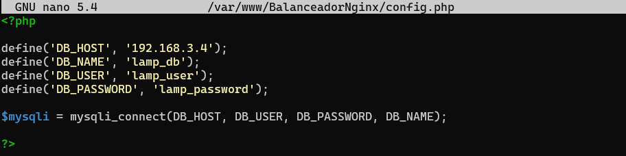

# BALANCEADOR DE CARGA EN NGINX
 En esta práctica deberemos automatizar la instalación y configuración de una aplicación web LEMP en cuatro máquinas virtuales. El objetivo de esta práctica es crear una arquitectura de alta disponibilidad que sea escalable y redundante, de modo que podamos balancear la carga entre todos los frontales web.
 
 Un balanceador de carga es un dispositivo hardware o software que se pone al frente de un conjunto de servidores y se encarga de asignar o balancear las peticiones que llegan de los clientes hacia los servidores

* # CONFIGURACIÓN VAGRANT
Antes de comenzar, crearemos una carpeta en nuestro ProyectoVagrant para desplegar nuestras máquinas virtuales con el archivo "vagrantfile". Para ello creamos la carpeta que llamaremos BalanceadorDeCargaNginx con el siguiente comando: 

    mkdir BalanceadorDeCargaNginx

Para crear el archivo "vagrantfile" con su correspondiente configuración, lo primero que haremos será entrar en nuestra carpeta, en la cual levantaremos las cuatro máquinas y utilizando el siguiente comando:

    vagrant init

Nos aparecerá en el terminal el siguiente mensaje, como que se ha creado correctamente el archivo "vagrantfile"

Modificaremos nuestro archivo "vagrantfile" para levantar nuestras cuatro máquinas virtuales generic/debian. Para ello hay que tener en cuenta las siguientes características:

1. Deberemos tener una máquina, la cual llamaremos **elviramysql**, esta tendrá una red privada, que esté conectada a la misma red de las máquinas **elviranginx** y **elviranginx2**, además de una red pública (sola mente para descargar los archivos de configuración, después deberemos quitarla).

    

2. Para la segunda máquina y tercera máquina, la cual llamaremos **elviranginx** y **elviranginx2**, estas tendrán dos redes privadas, una en la misma red de la máquina **elviramysql** y otra en la misma rede de **elvirabalanceador**, además de una red pública (sola mente para descargar los archivos de configuración, después deberemos quitarla).

    
    

3. Para la última máquina, la cual llamaremos **elvirabalanceador**, deberá estar en la misma red de las dos máquinas mencionadas anteriormente, **elviranginx** y **elviranginx2**, además de tener una red pública. 

    

A partir de este momento, con la configuración de red creada en nuestras máquinas virtuales, en el vagrantfile, crearemos varios scripts de aprovisionamiento para automatizar descargas :

1. Descargar automáticamente paquete de MySQL (elviramormysql).

    
   
2. Descargar automáticamente los servidores Nginx, Php y MySQL Cliente con todos sus módulos (elviranginx) y (elviranginx2).

    

3. Descargar automáticamente los servidores Nginx y MySQL Cliente con todos sus módulos (elvirabalanceadornginx)

    

**Hay que tener en cuenta, que, si quitamos en el archivo de aprovisionamiento la puerta de enlace, puede dar fallos a la hora de clonar los repositorios en nuestra máquina virtual, es recomendable quitarlos una vez clonados los repositorios**.

Una vez configurado el archivo vagrantfile, levantaremos las dos máquinas para ver si se nos han descargado correctamente los paquetes de MySQL, Apache, Php y MySQL Cliente. 

        vagrant up

También podemos utilizar el mismo comando para levantar una a una las maquinas con el comando:

        vagrant up elviramysql
        vagrant up elviranginx
        vagrant up elviranginx2
        vagrant up elvirabalanceador

* # CONFIGURACIÓN ELVIRAMYSQL

En este momento, comenzaremos a configurar la máquina **elviramysql**, conectándonos por ssh a la máquina con el comando:

    vagrant ssh elviramysql

En primer lugar, modificaremos el archivo **50-server.cnf** que se encuentra en la ruta:

    cd /etc/mysql/mariadb.conf.d

Y buscaremos la línea **bind-address** modificando la dirección que se encuentra por defecto 127.0.0.1 a la dirección de nuestro servidor mysql **192.168.3.4**

 

Una vez cambiada la dirección realizaremos un restart a nuestro mysql, es muy importante realizarlo ya que nos podría darnos error al terminar la práctica y conectarnos a nuestra página web:

    sudo systemctl restart mysql

Ahora podremos empezar con la configuración de los archivos mysql, en primer lugar, daremos de alta a un nuevo usuario, y le asignaremos unos privilegios. En este caso utilizaremos el usuario **root**, pero tenemos que asignarle una contraseña.

    sudo mysql_secure_installation

 

Una vez cambiado la contraseña al root, crearemos un usuario llamado **lamp_user** con su contraseña **lamp_password**, además de darle unos privilegios, pero solo para esta base de datos **lamp_db**, para ello utilizaremos los siguientes comandos:

    mysql -u root -p
    create user 'lamp_user'@'%'identified by 'lamp_password';
    grant all privileges on lamp_db.* to 'lamp_user'@'%';
    flush privileges;

Para verificar que hemos creado bien el usuario nuevo, nos dirigiremos a la base de datos **mysql** y mostraremos las tablas **user** y **host**.

Una vez creado el usuario clonaremos el repositorio de [iaw-practica-lamp](https://github.com/josejuansanchez/iaw-practica-lamp.git), para obtener nuestro archivo de la base de datos, **database.sql**. 

Entraremos dentro de la carpeta **db** que se encuentra en el repositorio clonado anteriormente y quitaremos las últimas tres líneas que dan error al iniciar la base de datos por la creación de un nuevo usuario.

    cd /iaw-practica-lamp/db
    sudo nano database.sql

Una vez eliminado las líneas, procederemos a cargar la base de datos, y comprobar que se encuentra en nuestro mysql-server, :

    mysql -u root -p < database.sql
    mysql -u root -p

Al cargar la base de datos en nuestro servidor de mysql, por seguridad borraremos la carpeta **iaw-practica-lamp**

    sudo rm -r iaw-practica-lamp

Para finalizar la configuración de **elviramysql**, deberemos quitarle la puerta de enlace, para que no tengan conexión con **elvirabalanceador**, únicamente con las máquinas **elviranginx** y **elviranginx2**

    sudo ip route del default

 
* # CONFIGURACIÓN ELVIRANGINX Y ELVIRANGINX2     
  
Una vez configurado **elviramysql**, pasaremos a configurar **elviranginx** y **elviranginx2**. 

Lo primero que deberemos crear será una carpeta llamada **BalanceadorNginx** y dentro de esta carpeta clonaremos el repositorio de github, [iaw-practica-lamp](https://github.com/josejuansanchez/iaw-practica-lamp.git). Moveremos todos los archivos que se encuentran en la carpeta **src** a la carpeta de **BalanceadorNginx**, además cambiaremos el dueño y el grupo **www-data.www-data**:

    cd /var/www
    sudo mkdir BalanceadorNginx
    cd /var/www/BalanceadorNginx
    sudo git clone (URL-Repositorio)
    sudo mv /var/www/BalanceadorNginx/src/* /var/www/BalanceadorNginx
    cd /var/www
    sudo chown -R www-data.www-data BalanceadorNginx

Una vez movido el contenido de la carpeta iaw-practica-lamp al directorio BalanceadorNginx, borraremos la carpeta iaw-practica-lamp.

    sudo rm -r iaw-practica-lamp

Dentro de la carpeta que hemos creado y configurado, nos encontramos con un archivo llamado **conf.php**, el cual deberemos modificar **('DB_HOST'_'localhost');** por la dirección de nuestro Servidor Mysql (elviramysql), en mi caso **192.168.3.4**

Después de clonar el repositorio y hacer su debida configuración, pasaremos a la **configuración de Nginx para comunicarse con php-fpm a través de socket TCP(IP)**.

## CONFIGURACIÓN DE PHP-FMP
---
   
En primer lugar, tenemos que modificar el archivo **www.conf** que se encuentra en la ruta **/etc/php/7.4/fpm/pool.d/www.conf**.

    sudo nano /etc/php/7.4/fpm/pool.d/www.conf

Una vez dentro del archivo observamos la línea que debemos cambiar **listen** se encuentra por defecto escuchando en el socket UNIX y deberemos modificarlo por la dirección de localhost de nuestra máquina **124.0.0.1** y un puerto, en este caso utilizaremos el puerto **9000**.

Cuando terminemos de realizar las modificaciones, deberemos reiniciar el servicio de php-fpm.

    sudo systemctl restart php7.4-fpm

## CONFIGURACIÓN DEL SERVICIO NGINX
---
Pasaremos con la configuración del Servicio Nginx, para ello, haremos una copia del archivo **default**, llamándolo **BalanceadorNginx** que se encuentra en la ruta **/etc/nginx/sites-available**.

    sudo nano /etc/nginx/sites-available/default

Una vez dentro del archivo, cambiaremos la línea dónde pone **root /var/www/html** por **root /var/www/BalanceadorNiginx**, el nombre de la carpeta que hemos creado anteriormente en esta ruta. Además, descomentaremos algunas líneas para la configuración y añadiremos a la línea dónde se encuentran los index, **index.php**.

Terminada la configuración, deberemos enlazar el archivo **BalanceadorNginx** de la ruta **/etc/nginx/site-available** a **/etc/nginx/sites-enable**, con el siguiente comando y borrar el archivo **default** de la carpeta **sites-enable:

    sudo ln -s /etc/nginx/sites-available/BalanceadorNginx /etc/nginx/sites-enable
    sudo rm /etc/nginx/sites-enable/default

Terminados estos pasos, verificaremos que la sintaxis del archivo **BalanceadorNginx**, es correcta, si es así, al haber realizados cambios reiniciaremos el Servicio Nignx. 

    sudo nginx -t
    sudo systemctl restart nginx

Una vez terminada esta configuración, en nuestro navegador, pondremos la dirección pública de nuestra máquina **elviranginx** y nos tendrá que redirigir a la página web donde podremos añadir, modificar y eliminar los usuarios de nuestra base de datos.

Llegado a este paso, volveremos a realizar la misma configuración en la máquina **elviranginx2**, y verificaremos que también con la dirección pública de esta máquina tendrá que redirigirnos a la página web, igual que **elviranginx** donde podremos añadir, modificar y eliminar los usuarios de nuestra base de datos.

Verificado que tenemos acceso a nuestra página web, deberemos quitarle las ip públicas, ya que deberemos acceder a través de nuestro balanceador (dirección pública), para visualizar nuestras páginas web

* # CONFIGURACIÓN ELVIRABALANCEADOR

Para finalizar, deberemos configurar un servidor balanceador de carga (**elvirabalanceador**) para que distribuya la carga entre ambos servidores **elviranginx** y **elviranginx2**.

Primero, debemos eliminar el archivo **/etc/nginx/sites-available/default**, y crearemos otro archivo llamado **ConfigBalanceador**, en su interior deberemos escribir lo siguiente:

    cd /etc/nginx/sites-available
    sudo rm default
    sudo nano ConfigBalanceador

Terminado, solamente deberemos enlazar el archivo **ConfigBalanceador** de la ruta **/etc/nginx/site-available** a **/etc/nginx/sites-enable**, con el siguiente comando y borrar el archivo **default** de la carpeta **sites-enable**:

    sudo ln -s /etc/nginx/sites-available/ConfigBalanceador /etc/nginx/sites-enable
    sudo rm /etc/nginx/sites-enable/default
    
    
Antes de terminar la configuración, verificar que la sintaxis del archivo que hemos cambiado está correcta.

    sudo nginx -t

Si está correcta la sintaxis, deberemos reiniciar nuestro servicio de nginx

    sudo systemctl restart nginx

Llegado a este momento, comprobaremos que nuestro balanceador funciona correctamente **elvirabalanceador**. Verificaremos con la dirección pública de esta máquina, en este caso [http://192.168.1.224](http://192.168.1.224), tendrá que redirigirnos a la página web donde podremos añadir, modificar y eliminar los usuarios de nuestra base de datos.

